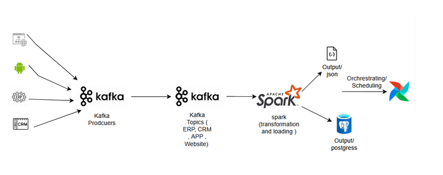
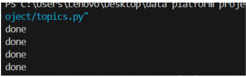
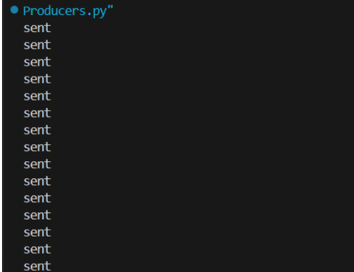
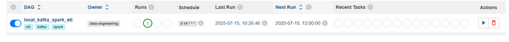

#  Local Event-Driven Data Platform — Kafka, Spark, Airflow

A modular **offline-first ETL platform** built for simulating real-time event ingestion from diverse sources like CRM, ERP, websites, and mobile apps. The pipeline uses **Kafka** for event transport, **PySpark** for transformation, and **Airflow** for orchestration — all running locally via Docker.

---

##  Who Is This For?

-  **Data Engineers** learning Kafka, PySpark, and Airflow in a fully offline, local setup.
-  **Real Estate Tech Teams** needing a prototype ETL backbone for operational data.
-  **Students or Bootcampers** building hands-on experience in streaming pipelines.

---

## High-Level Architecture

┌──────────────┐     ┌──────────────┐     ┌────────────────────┐     ┌───────────────────────────────┐     ┌────────────────────┐     ┌────────────────────┐
│ Kafka        │ --> │ Kafka Topics │ --> │ Spark Structured   │ --> │ JSON Output & Archiving      │ --> │ Airflow DAG        │ --> │ Reporting Tools    │
│ Producers    │     │ (CRM, ERP,   │     │ Streaming Consumer │     │  • /output/ JSON             │     │ (Daily @ 2PMcairo time)     │     │ (Optional – PowerBI│
│ (Mock Events)│     │ Website, App)│     │   • Parse / Clean  │     │  • /archive/ by timestamp    │     │ 1. produce         │     │  or Excel, etc.)   │
└──────────────┘     └──────────────┘     └────────────────────┘     └───────────────────────────────┘     └────────────────────┘     └────────────────────┘
      ▲                                                                                                                            │
      └────────────────────────────── Controlled via Airflow DAG Scheduler ────────────────────────────────────────────────────────┘




---

Screenshots:n
 
 1. Terminal – Running topics.py

Kafka topics are created and confirmed via terminal logs:

$ python dags/topics.py



 2. Terminal – Running producers.py

Mock events are successfully pushed into Kafka topics:

$ python dags/producers/producers.py



3. Airflow DAG Triggered Manually

This shows the DAG triggered from the UI and successfully executing tasks (producing events, transforming with Spark, and storing output):



##  Tech Stack

- **Apache Kafka** – Topic-based event queue
- **PySpark** – Structured streaming + transformation
- **Apache Airflow** – Scheduling and workflow orchestration
- **PostgreSQL / JSON** – Output targets for cleaned data
- **Docker Compose** – Local orchestration for all services

---

##  Project Structure

```bash
project-root/
├── docker-compose.yml              # Defines Kafka, Airflow, Spark, Postgres containers
├── .env                            # Env variables (e.g., email alerts)
├── output/                         # Transformed JSON output
├── archive/                        # Historical snapshots
├── dags/
│   ├── etl_dag.py                  # Airflow DAG definition
│   ├── producers/
│   │   └── producers.py            # Mock event emitters to Kafka topics
│   └── spark_jobs/
│       └── spark_consumer.py       # Spark structured streaming logic
── docs/
│   ├── architecture.png            # Architecture diagram└── README.md

│   └── screenshots/
│       ├── airflow_dag_success.png         #Airflow 
│       ├── topics_created.png              #Terminal Output of topics.py
│       └── producers_running.png           #Terminal Output of producers.py


##  How to Run

> Prerequisites:
- Docker Desktop
- Python 3.11 (for Spark and Airflow)
- Git

### 1. Clone the repository

```bash
git clone https://github.com/yourusername/data-platform.git
cd data-platform
````

### 2. Configure secrets

Create a `.env` file for your Gmail SMTP (for Airflow alerts):

```env
GMAIL_APP_PASSWORD=your_generated_app_password
```

### 3. Start Docker services

```bash
docker-compose up --build
```

Then visit Airflow UI at `http://localhost:8080`
Login with:
`Username: airflow`
`Password: airflow`

---

##  Testing

* Manual Run: Trigger the DAG manually from Airflow UI
* Daily Cron: DAG is scheduled to run every day at 2:00 PM GMT+3
* Output is written to `/output/` and archived to `/archive/`

---

## 🛠️ Troubleshooting & Production Tips

* Spark memory crashes? Restart your machine to reset JVM memory.
* Airflow DAG not showing up? Ensure DAG file is in `/dags/` folder that is volume-mounted inside container.
* Use `.env` + `.gitignore` to protect sensitive SMTP data.
* Don't run Airflow on Windows natively — use Docker or WSL2.

---

##  Notes

* No cloud dependencies.
* Kafka topics and events are mock generated locally.
* Ideal for testing real-time event data pipelines offline.


##  Additional Docs

- [Full Project Documentation (PDF)](docs/project-documentation.pdf)

---

## License

MIT

